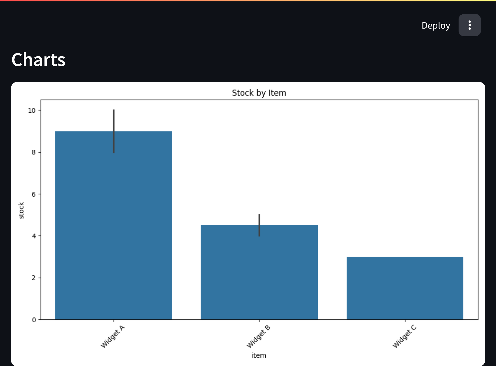

# 📦 Inventory & Revenue Tracker (Streamlit App) 
This app helps solo sellers manage old stock by uploading an Excel file, automatically cleaning and visualizing business data, and downloading detailed PDF reports. Built with Python, Pandas, Seaborn, and Streamlit.

- Upload excel files via the GUI
- Clean and validate the data automatically
- Generate visual charts
  - Stock by item
  - Income vs. Expenses
  - Revenue by item
  - Shipping cost over time
- Download pdf summary report

## Folder Structure
streamlit_app.py # Streamlit GUI app
  src/ # Core logic
    upload.py
    clean.py
    visualize.py
    report.py
uploads/ # Uploaded Excel files
data/ # Cleaned Excel files
output/ # PNG charts
reports/ # PDF reports

## Excel File Format (Required)
Your Excel file must include these column headers:

| Column          | Description                           |
|------------------|---------------------------------------|
| `Date`          | The transaction date (e.g. 2024-01-01) |
| `Item`          | Product name                           |
| `Stock`         | Quantity in stock                      |
| `Price`         | Unit price                             |
| `Shipping Cost` | Cost to ship item (optional)           |
| `Expense`       | Additional expense (e.g. packaging)    |
| `Income`        | Gross income from sale                 |
| `Revenue`       | Net profit (Income - Expense)          |

## How to Run

1. Install dependencies:
bash
pip install -r requirements.txt

2. Run the app
streamlit run streamlit_app.py

3. Use the interface to:
  - Upload your Excel file
  - View the cleaned data
  - Visualize charts
  - Download the PDF report

### 6. Example Output

## Uploading Your Excel File

## Example Charts

